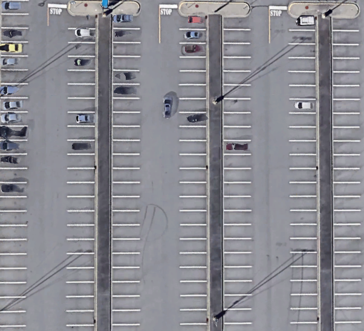

<h1 align="center">PARKING SPOT AVAILABILITY CHECKER</h1>

ABOUT:

This program determine if a selected parking spot is full or empty.
The user selects a parking spot by clicking of the top-left corner of the said spot.
Selections are saving in the posList file and reloaded in each run.

The selected spot is then coveted to a threshold image and the number of pixels is counted,
if the number of pixels is hight ( > 130) then the spot is most likely occupied. 

Dependencies:

python-3.8+

python3-pip

python3.8-venv

-----------------------------------------------------------

HOW TO RUN:

cd virtualEnv

source bin/activate

pip install -r req.txt

python3 PL-space-detector.py 

TO CLOSE PROGRAM PRESS THE SPACE BAR
